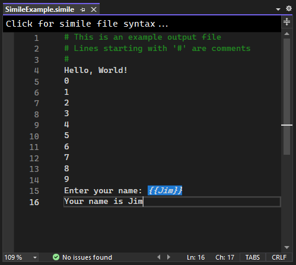

# ConsoleCompare
A Visual Studio extension for comparing the result of a console application to a given output set.

A custom file format, a *Console Simile* (stored in a .simile file), defines the expected console application output and user input.

---

## For Students & Graders
- Load a pre-made *Console Simile* file (provided by an instructor or TA) that defines expected console output.
- Press "Run" to build your C# console application and automatically compare its output to the simile.

- Additionally, the extension scans code files within the project for XML comments and displays a summary of found vs. expected comments.
    - Further details, such as which types of code elements (class defintions, methods or properties) are lacking XML comments, are also available.

## For Instructors/TAs
- Easily create new simile files in Visual Studio with Project > Add New Item...
- Simile file editing made easy with syntax highlighting and error checking.
- Simile syntax quick reference available at the top of each simile file tab.

---

## Simile File Syntax
 
### General
- Lines beginning with # are comments and are ignored.
- All other lines are processed as expected program output, including blank lines.
 
### Input Tags
- User input fed into the program is represented by a string inside `{{ }}`.
- Examples: `{{Hello there}}` or `{{12345}}` or `{{Jimmy}}`.
- Input tags MUST appear at the end of a line or on a line by themselves.
- Input tags CANNOT appear on a line with a numeric tag (see below),
      as text before an input tag must have a finite length.
 
### Numeric Tags
- Numeric data that needs to be parsed and checked for validity can be denoted inside `[[ ]]`.
- Several options exist for data validation (see below).
- Multiple options can appear in a single `[[ ]]`, separated by semicolons.
- Multiple numeric tags may appear on the same line.
- Numeric tags appearing before the end of a line must be followed by a space.
- Numeric tags CANNOT appear on a line with an input tag, 
      as text before an input tag must have a finite length.
   
 ### Numeric Tag Syntax
- `type` or `t` (required)
  - Supported data types: `byte, sbyte, short, ushort, int, uint, long, ulong, float, double, char`
  - Short names: `b, sb, s, us, i, ui, l, ul, f, d, c`
  - Examples: `[[t=s]]` or `[[type=s]]` or `[[t=short]]` or `[[type=short]]` would be parsed as a short
     
- `min` & `max` (optional)
  - Inclusive minimum and/or inclusive maximum for parsed numeric value
  - Values will be parsed in accordance with the type option
  - Examples: `[[t=int;min=-10]]` or `[[t=double;min=3.14159]]` or `[[t=double;max=99]]` or `[[t=sbyte;min=-5;max=5]]`
     
- `values` or `v` (optional)
  - A set of one or more expected values
  - Values will be parsed in accordance with the type option
  - Examples: `[[t=int;v={1,2,3,4}]]` or `[[t=int;values={5,10,15,20}]]` or `[[t=short;v={88}]]`

- `precision` or `p` (optional)
  - Rounds the results to the given precision for checking
  - Value must be an integer between 0-15 (inclusive)
  - Only used if overall data type is float or double
  - examples: `[[t=double;precision=3]]` or `[[t=d;p=5]]`

### Complex Numeric Tag Examples
`The circle has a radius of [[t=double;min=0;max=100;p=3]] inches.`
- This line of output expects a double between the words "of" and "inches".
- Additionally, that value will be rounded to 3 decimal places and verified to be between 0-100 (inclusive)

`Player [[t=int;v={1,2,3,4}]] has a score of [[t=int;min=5]].`
- This line of output expects two integers
- The first must be the number 1, 2, 3 or 4
- The second can be any integer >= 5
